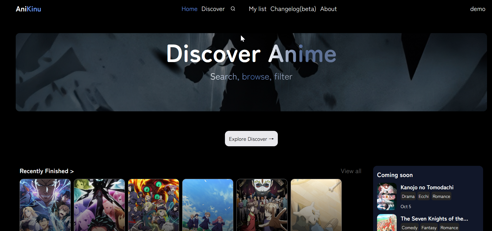
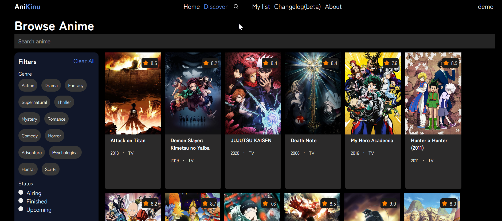
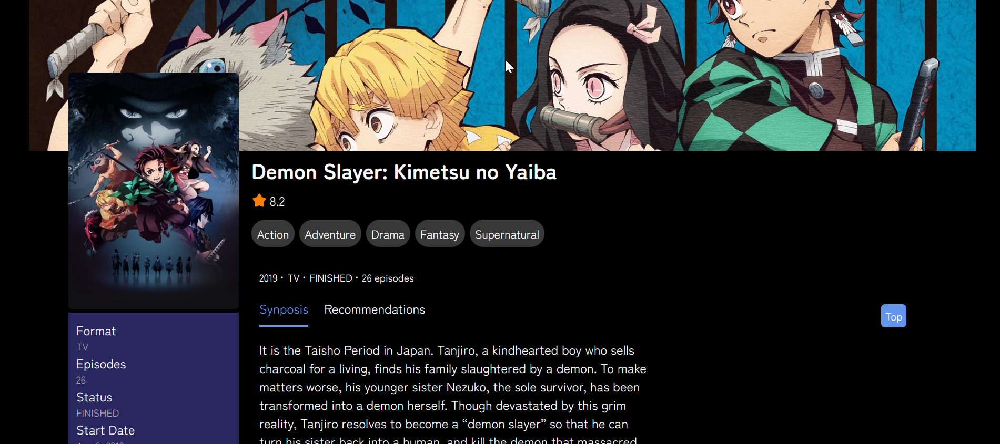

# AniKinu

AniKinu is a full-stack anime catalogue and discovery application built around data from the AniList GraphQL API.

It provides a searchable, filterable catalogue of anime, user authentication, personal list tracking, detailed anime pages, recommendations, trending titles, top-rated anime, recently finished series, and upcoming releases.

The application uses PostgreSQL as its source of truth for both application state (user accounts, watchlists) and periodically ingested AniList catalogue data, all exposed through a custom Express REST API.

---

## Features

### Anime Discovery

- Browse a large anime catalogue
- Search for anime by title
- Filter anime by:
  - Genre
  - Tag
  - Year
  - Season
  - Status
  - Format
- Sort results
- Paginate through results
- Filter by multiple genres
- Browse upcoming anime

### Authentication & User Management

- Secure user registration and login (JWT/session-based auth)
- Personalized status tracking (Watching, Completed, Plan to Watch, etc.)
- Custom My-List dashboard to manage your anime progress and favorites

### Anime Details

Each anime has its own detail page containing information such as:

- Titles
- Description
- Format
- Status
- Episode count
- Episode duration
- Season
- Release dates
- Average score
- Popularity
- Genres
- Tags
- Synonyms
- Source material
- Country of origin
- Cover image
- Banner image
- External AniList page
- Characters
- Staff
- Studios
- Recommended anime

### Home Page

The home page provides several curated sections for quickly discovering anime:

- Trending anime
- Top-rated anime
- Recently finished anime
- Upcoming anime

### User Experience

- Responsive desktop and mobile layouts
- Mobile-friendly horizontal anime carousels
- Desktop catalogue-style layouts
- Responsive navigation
- Search suggestions from the navbar
- Blur-up image loading for smoother image rendering
- Dedicated discovery interface
- Smooth pagination and navigation

---

## Tech Stack

### Frontend

- React
- React Router
- JavaScript
- CSS

### Backend

- Node.js
- Express

### Database

- PostgreSQL

### Data Source

- AniList GraphQL API

### Deployment

- Netlify — Frontend
- Render — Backend
- Neon — PostgreSQL

---

## Architecture

AniKinu separates the external anime data source from the application itself.

AniList is used as the upstream data source, while PostgreSQL acts as the application's source of truth.

Normal page requests do not query AniList directly. Instead, the frontend communicates with the Express API, which retrieves data from PostgreSQL.

This allows the application to remain independent from AniList during normal browsing and gives AniKinu full control over how data is queried, filtered, sorted, and presented.

## Data Ingestion

AniKinu includes a separate ingestion process for collecting anime information from AniList.

The ingestion pipeline is:

```text
AniList 
│
▼
Fetch
│
▼
Validate
│
▼
Normalize
│
▼
Deduplicate
│
▼
Upsert
│
▼

```

PostgreSQL

The ingestion process collects information such as:

- Titles
- Descriptions
- Airing status
- Dates
- Genres
- Tags
- Scores
- Popularity
- Images
- Relations
- Recommendations
- Metadata

Anime records use the AniList ID as a unique identifier. This allows repeated ingestion runs to update existing records instead of creating duplicate anime entries.

## Database

PostgreSQL stores both the anime catalogue and user data (accounts, watchlists, and progress). 

The `anilist_id` is uniquely constrained so that the same anime cannot be inserted multiple times during ingestion.

## Development 

```bash
# Install dependencies (adjust paths if using a monorepo setup)
npm install

# Run development server
npm run dev

```

## Status

Anikinu is currently in development

## Screenshots

### Home




### Discover 


### Anime Details
